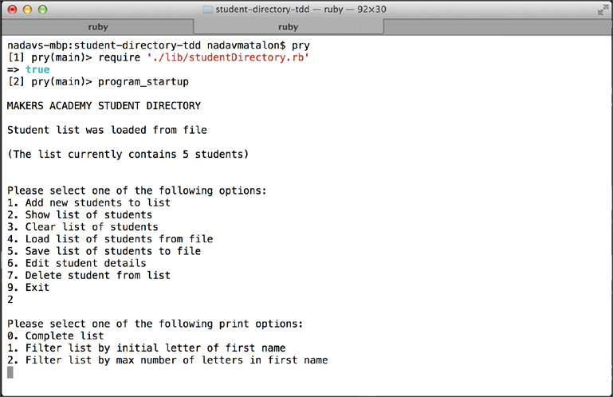
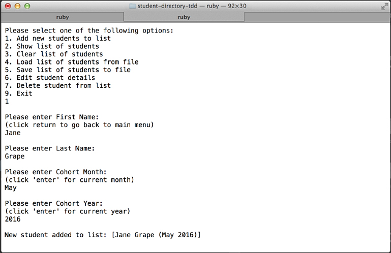
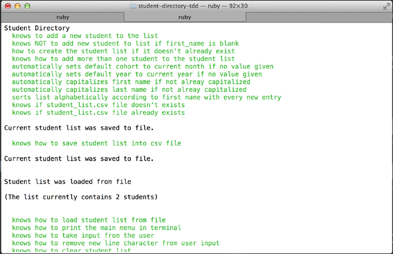

#Student Directory [TDD](http://en.wikipedia.org/wiki/Test-driven_development)

## Table of Contents

* [Screenshots](#screenshots)
* [General Description](#general-description)
* [How to Run](#how-to-run)
* [Functional Description](#functional-description)
* [Testing](#testing)
* [License](#license)


##Screenshots

<table>
	<tr>
		<td align="center" width="210px">
			<a href="https://raw.githubusercontent.com/nadavmatalon/student-directory-tdd/master/images/student_directory_1.jpg">
				<br/>
			</a>
		</td>
		<td align="center" width="210px">
			<a href="https://raw.githubusercontent.com/nadavmatalon/student-directory-tdd/master/images/student_directory_2.jpg">
				<br/>
			</a>
		</td>
		<td align="center" width="210px">
			<a href="https://raw.githubusercontent.com/nadavmatalon/student-directory-tdd/master/images/student_directory_3.jpg">
				<br/>
			</a>
		</td>
	</tr>
</table>


##General Description

This code was written in [Ruby](https://www.ruby-lang.org/en/) (2.1.1) 
using [TDD](http://en.wikipedia.org/wiki/Test-driven_development) methodology.

The code was written during week 2 of the course at 
[Makers Academy](http://www.makersacademy.com/), 
and it consists of a __re-write from scratch__ of the original 
[Student Directory](https://github.com/nadavmatalon/student-directory) code 

The purpose of this code is to enable users to manage the list of students enrolled 
in different courses (aka "cohorts") at [Makers Academy](http://www.makersacademy.com/).


##How to Run

Clone the repo to a local folder and run:

```
$> cd student-directory-tdd
$> irb
>> require './lib/studentDirectory.rb'
>> program_startup
```

##Functional Description

The code enables users to create a list of enrolled students, input various details 
about them (first name, last name, cohort month and cohort year), as well as load and 
save the list in an indepent [CSV](http://en.wikipedia.org/wiki/Comma-separated_values) file.

When first running the app in terminal, the list of students will automatically be loaded 
from a [CSV](http://en.wikipedia.org/wiki/Comma-separated_values) 
file (see "Save student List" & "Load student list" below for more details). 

If the said file doesn't already exist, the script will create it automatically 
(the file is located in the same folder as the script) 

Relevant prompts are given regarding whether the list was loaded from file or if a 
new file was created.

Subsequently, the user is presented with a main menu containing the following options:

	1. Add student names to the list

	2. Show list of students

	3. Load student list

	4. Save student list

	5. Clear student list

	6. Edit student details

	9. Exit program

To select one of these options, the user needs to enter the relevant option-number 
and click `enter`. 

Note that entering anything other than an acceptable option-number 
(namely: "1", "2", "3", "4", "5", "9") will result in a prompt 
to the user to try again followed by re-presentation of the main menu.


###Explanation on each Main Menu Item

####1. Add student names to the list

When selecting this menu-option, the user is first asked to input the first name of 
the student, followed by their last name, cohort month, and cohort year.

When first or last names are entered without an initial capital letter, the initial 
letter of the name will be capitalized automatically.

The names on the list are automatically indexed and sorted alphabetically according 
to the student's first name (this operation takes place after each new name entry).

Inputting either an illegitimate month name or year will generate an "incorrect input" 
message followed by a prompt to the user to try again.

Note that uncapitalized month names are acceptable as input as they are capitalized 
automatically by the script.

If the user simply clicks "enter" without giving input regarding the student's Cohort 
Month or Cohort Year - they will be set to the current month/year by default.

To go back to the main menu, the user simply needs to click "enter" without entering a 
new name when prompted to add a new First Name for a student.


####2. Show list of students

After selecting this option, the user is asked to choose between three alternative 
presentation modes:

	0. Complete student list

	1. Filter student list by initial letter of first name - selecting this option will 

	2. Filter student list by max number of letters in first name

As expected, selecting "0" will print the entire list to the terminal. 

If the user selects "1", s/he are then asked to enter a single letter by which to 
filter the student names.

Note that entering anything other than a single letter will result a prompt to the 
user to try again.

Also note that if the user enters a lower-case letter, the letter will automatically 
be capitalized.

If the user selects "2", s/he are asked to enter the maximum number of letters in a 
given name by which to filter the list (the maximun accepted number is limited to 100,000).

If the user enters anything other than an integer, they are asked to try again.

In each of the above presentation modes the student list includes:

* a header
* an indexed list of student names (sorted automatically in alphabetical order)
* a footer that quotes the overall number of students on the list (regardless of whether 
  the list was filtered or not).


####3. Load student list

Users can manually load an existing list of students from a file (filename: “students.csv”).

The file is located in the same directory as the ruby script (see next menu item).

__IMPORTANT:__ loading an existing list will overide any changes that were made in the 
list during that particular session!  


####4. Save student list

Users can save the current student list to a file (filename: "students.csv") which will 
be located in the same directory as the ruby script.

Note that if the file doesn't exist, it will be created automatically by saving 
the current list.

Also note that saving the file will automatically overwrite previous versions of 
the file if the latter already exists.


####5. Clear student list

Users can clear the current list of students by selecting this option.

The script will ask users to confirm this operation prior to execution.

In this context, the script is configured to accept various afermative/negative 
answers from users (i.e. "Yes", "yes", "YES", "Y", "y" and their negative equivalents).


####6. Edit student details

Users can edit the details of a particular student by selecting this option.

The script will ask users to select a student from the existing list and then 
proceed to allow changing of their first-name, last name, cohort month, and year.


####9. Exit program

Selecting this menu-option will end the script and return the user to normal terminal mode.

Before exiting the script, the user is asked if s/he would like to save the current list 
to a file (see: "load file" & "save file" options above).

As before, the script is configured to accept various affirmative/negative answers 
("Yes", "yes", "YES", "Y", "y" and their negative equivalents).


##Testing

Tests were written with [Rspec](http://rspec.info/) (3.1.7).

To run the tests in terminal: 

```bash
$> cd student-directory-tdd
$> rspec
```

##License

<p>Released under the <a href="http://www.opensource.org/licenses/MIT">MIT license</a>.</p>

